# Nodevas screenshots

Visual references for the Nodevas README and feature tour. Click any image to open the original asset.

## Demo workspaces

| Demo | Preview |
| --- | --- |
| AI harness engineering | [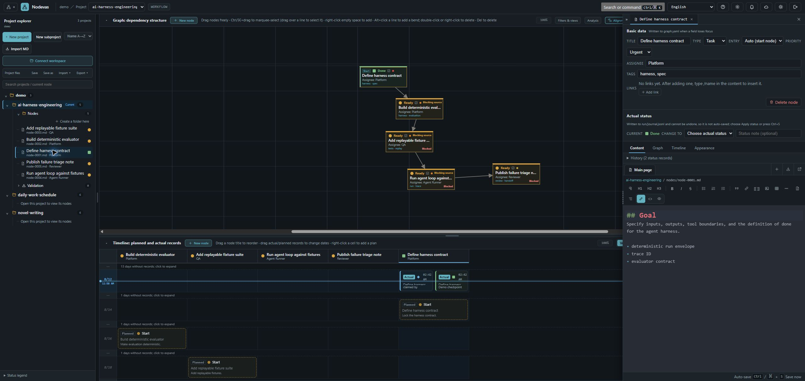](./demo-ai-harness-engineering.png) |
| Daily work schedule | [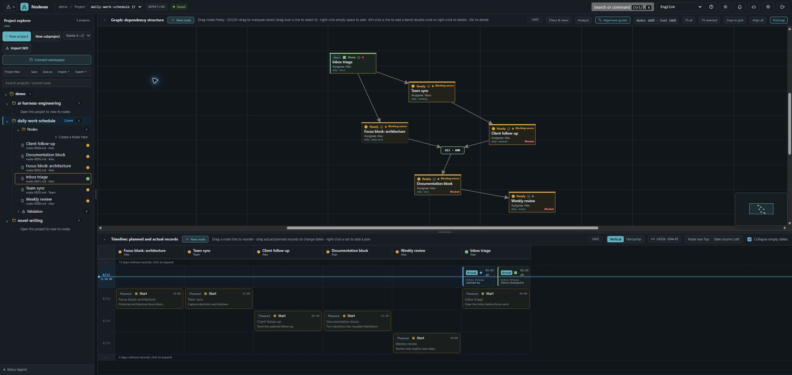](./demo-daily-work-schedule.png) |
| Novel writing | [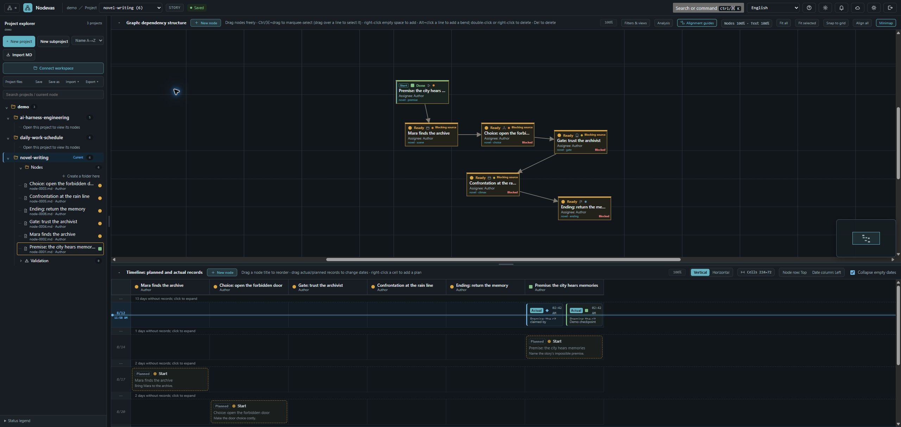](./demo-novel-writing.png) |

## Local-focus feature tour

The GIF keeps the full viewport at its normal scale and overlays a local focus window for each step. It does not zoom the browser page.

[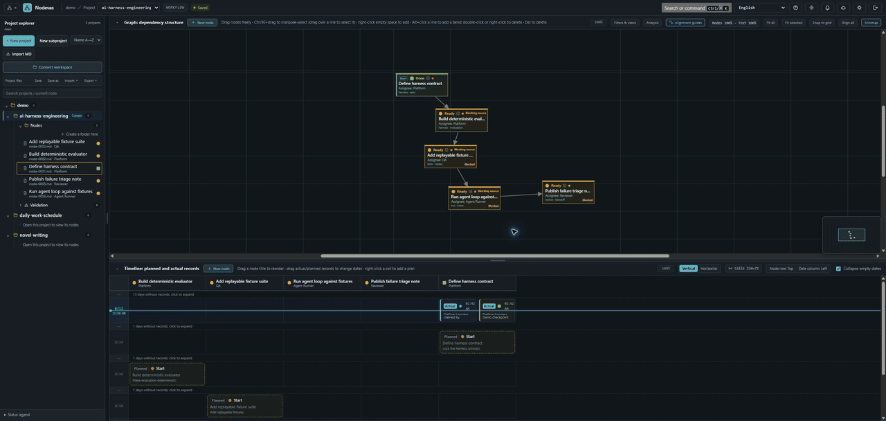](./nodevas-feature-tour.gif)

## Feature captures

| Feature | Preview |
| --- | --- |
| Add a node | [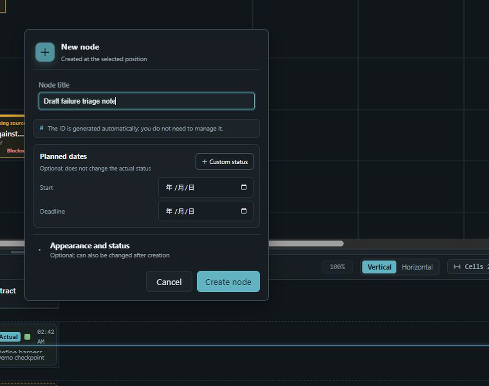](./feature-tour-01-add-node-focus.png) |
| Connect nodes | [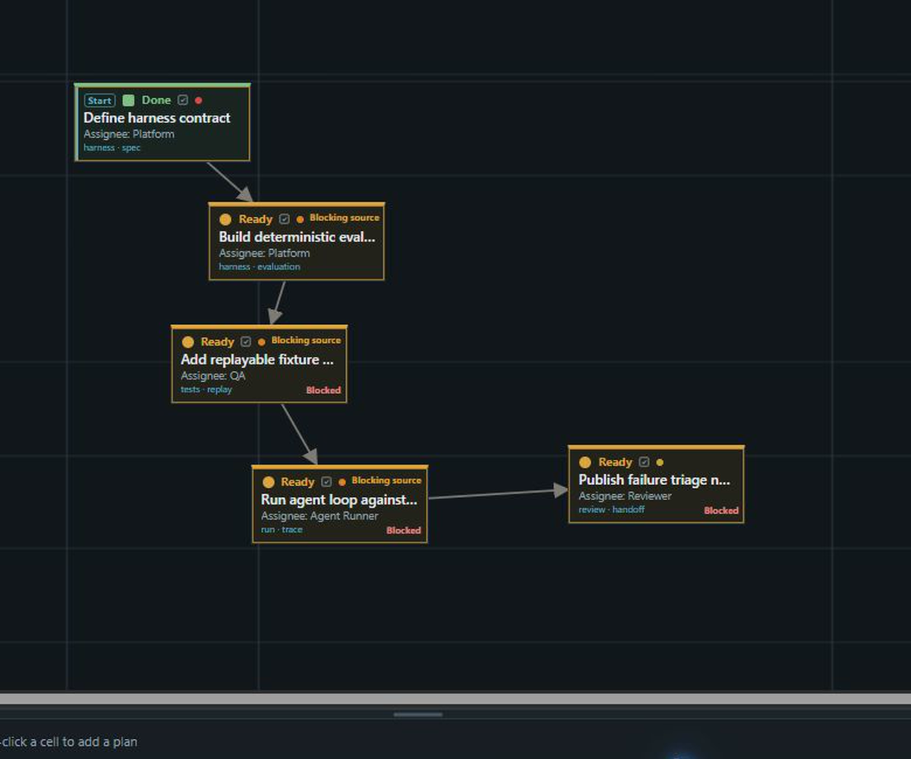](./feature-tour-02-connect-nodes-focus.png) |
| Edit node information | [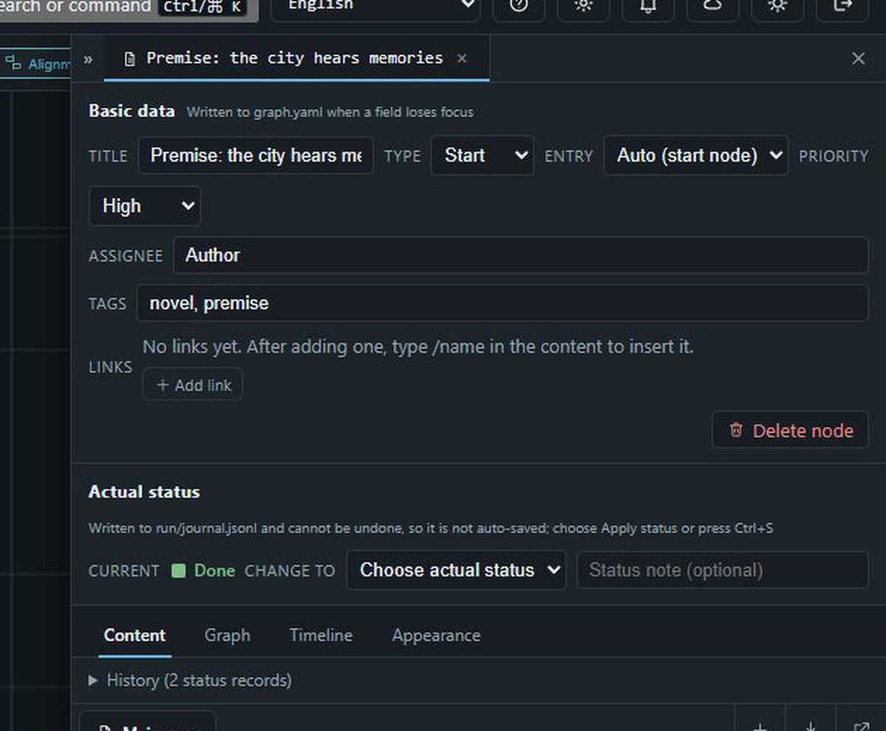](./feature-tour-03-info-panel-focus.png) |
| Edit Markdown content | [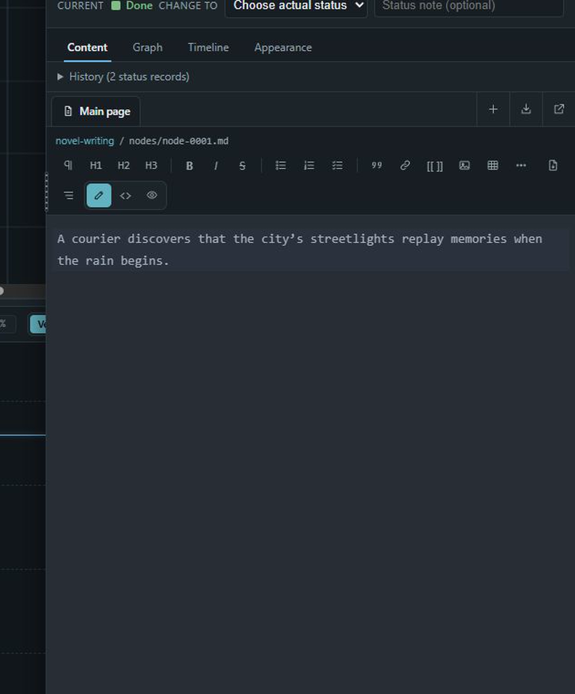](./feature-tour-04-content-editing-focus.png) |
| Plan work on the timeline | [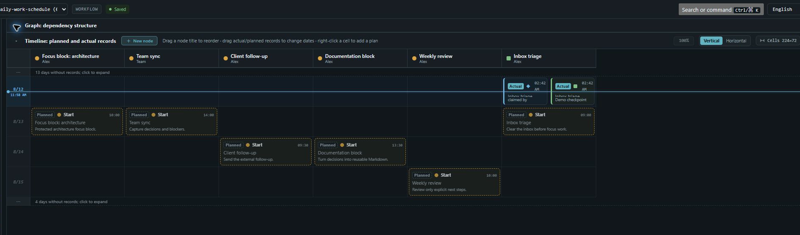](./feature-tour-05-timeline-focus.png) |
| Edit a planned timeline record | [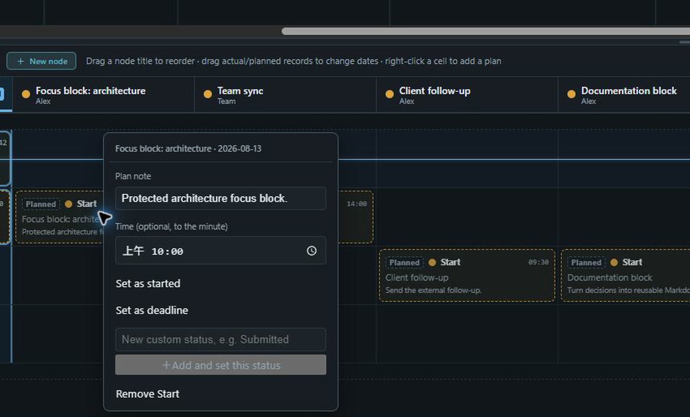](./feature-tour-05-timeline-editor-focus.png) |
| Prepare a status update | [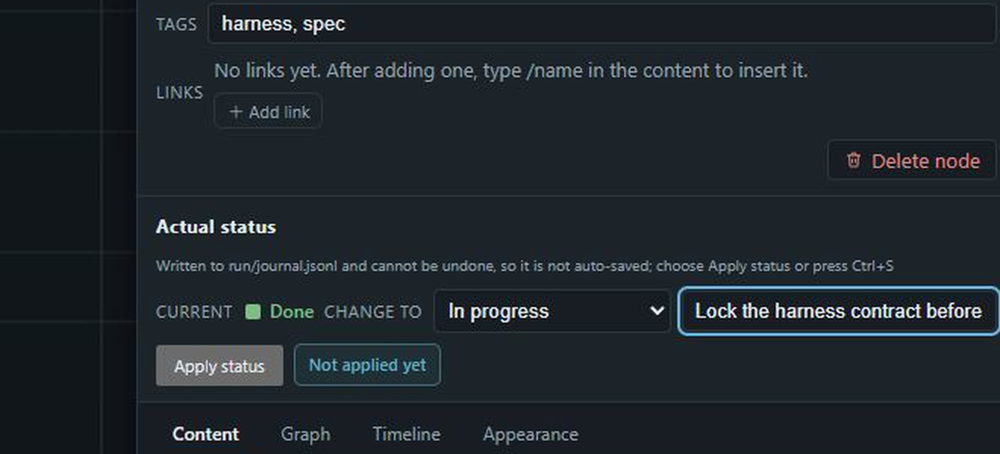](./feature-tour-06-status-focus.png) |
| English-first localization and dark mode | [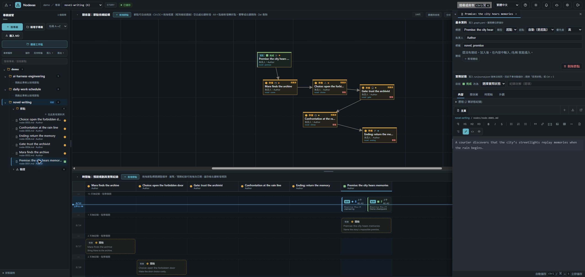](./nodevas-language-zh-tw.png) |

The focused stills are local crops enlarged for readability. The full-resolution source captures remain in this directory for documentation updates.
